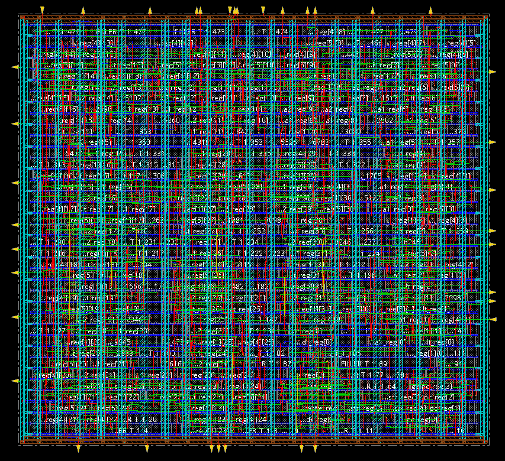
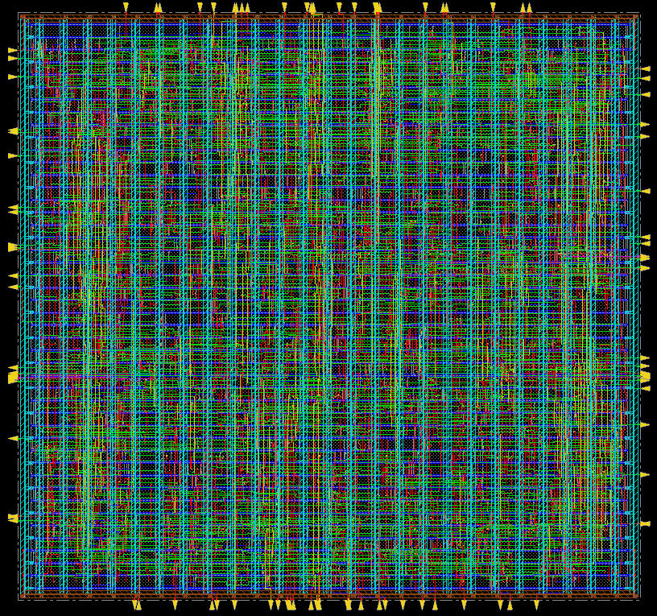
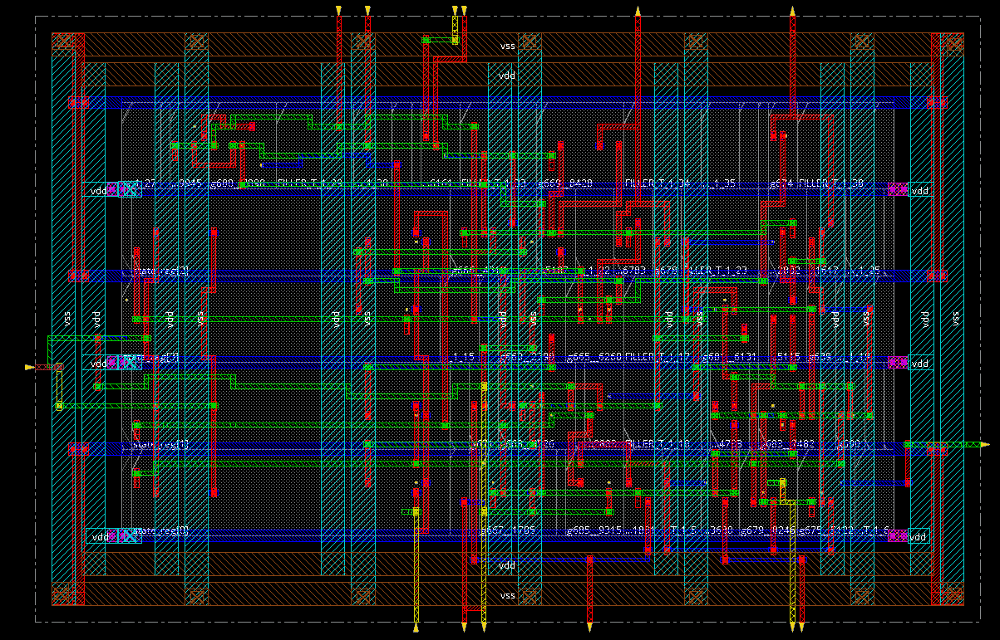
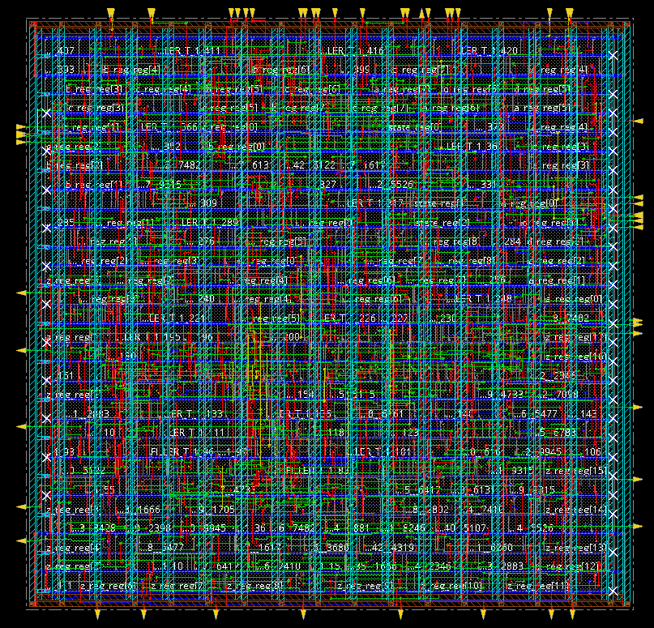

# ASIC Design Flow: RTL to GDSII using Cadence Tools

## Introduction

This repository contains the ASIC design flow implementation for digital circuits, RTL simulation to physical design using Cadence tools. The project includes `RTL code`, `testbenches`, `synthesis scripts`, `DFT insertion`, `LEC`, `ATPG`, and `physical design` steps.

Examples:
1. `4-Stage Pipelined CPU:`
To design, verify, and implement the complete RTL-to-GDSII flow for the control logic of a simplified 4-stage pipelined CPU (Fetch, Decode, Execute, Writeback). The design must be in synthesizable Verilog and include stall logic to handle Read-After-Write (RAW) data hazards.


2. `2R/1W CPU Register File:`
To design, verify, and implement a complete RTL-to-GDSII flow for an 8-register, 32-bit CPU register file. The design must be in synthesizable Verilog and feature two read ports (dual-port read), one write port, a synchronous write operation, and an asynchronous active-low reset.


3. `Multi-Cycle CPU FSM Control Unit:`
Create the synthesizable Verilog-based RTL to design a simple Control Unit (Finite State Machine) in Verilog for a single-cycle CPU executing instructions like LOAD, STORE, ADD, and BRANCH. Include instruction decode logic and a logic for control signals of how they derive for register file, ALU, and memory. Show the functional verification, code coverage and perform the logic equivalence check. Implement the physical design (to extract the output stream file .gds) using GPDK 90nm.


4. `Resource-Shared Datapath:`
Create the synthesizable Verilog-based RTL for a Datapath implementing the operation Z=(A+B)×(C−D). Apply resource sharing optimization between adders and multipliers. Show the functional verification, code coverage and perform the logic equivalence check. Implement the physical design (to extract the output stream file .gds) using GPDK 90nm.


## Tools Used

Some of the key tools used in this project are:
- Cadence `Xcelium` (xrun) for RTL simulation
- Cadence `Genus` for synthesis
- Cadence `Conformal` for Logic Equivalence Checking (LEC)
- Cadence `Modus` for Automatic Test Pattern Generation (ATPG)
- Cadence `Innovus` for physical design

## Table of Contents

- [Introduction](#introduction)
- [Tools Used](#tools-used)
- [Project Structure](#project-structure)
- [Prerequisites](#prerequisites)
- [Setup](#setup)
- [ASIC Design Flow (Lab-by-Lab)](#asic-design-flow-lab-by-lab)
  - [RTL Simulation using xrun](#rtl-simulation-using-xrun)
  - [Synthesis using Genus](#synthesis-using-genus)
  - [Logic Equivalence Checking (LEC) with DFT](#logic-equivalence-checking-lec-with-dft)
  - [ATPG using Modus](#atpg-using-modus)
  - [Physical Design using Innovus](#physical-design-using-innovus)
- [Key Outputs](#key-outputs)
- [Technology](#technology)
- [Notes](#notes)

## Project Structure

### 1_design/
RTL Verilog files and testbenches:
- Various digital circuits (counters, multipliers, processors, etc.)
- Testbench files (_tb.v)

### 2_work/
Simulation workspace(Xcelium and Nclaunch):
- Copied RTL files from 1_design that can be modified and improved
- Simulation outputs, logs, waveforms (.vcd)
- Cadence simulation files

### 3_synthesis/
Synthesis results using Genus:
- Netlists (.v files)
- SDC files (.sdc, .g)
- SDF files (.sdf)
- DFT-related files (scanDEF, ATPG outputs)
- Synthesis logs and scripts

### 4_lec/
Logic Equivalence Checking using Conformal:
- LEC scripts (.do files)
- Verification logs
- Generated library files

### 5_physical_design/
Physical design using Innovus:
- Floorplan, placement, routing files
- Timing and power reports
- GDSII outputs

### Assets/
Lab guides and documentation:
- Lab_1.txt: xrun simulation guide
- Lab_2.txt: Genus synthesis guide
- Lab_3_scripting_guide.txt & Lab_3_scripting.txt: Synthesis scripting
- Lab_4_LEC_guide.txt: LEC with DFT and ATPG
- Lab_5_modus_model_design_guide.txt: Modus ATPG guide
- Lab_6_physical_design_guide.txt: Innovus physical design
- Screenshots and additional resources

### Reference/
Additional reference materials.

## Prerequisites

- Linux environment
- Cadence tools: xrun, Genus, Conformal, Modus, Innovus
- 90nm libraries: slow.lib, fast.lib, LEF files at /home/install/FOUNDRY/digital/90nm/dig/
- C shell (csh) for setup

## Setup

```bash
csh
source /home/install/cshrc
```

## ASIC Design Flow (Lab-by-Lab)

### RTL Simulation using xrun

## Tool: NC Launch

Navigate to work directory:
```bash
cd 2_work
csh
source /home/install/cshrc
```

Run simulation:
```bash
xrun <rtl_code_filename> <testbenchcode_filename> -access +rwc -gui &
nclaunch # to open GUI and view waveforms
```

Example:
```bash
xrun four_bitcounter.v four_bitcounter_tb.v -access +rwc -gui &
nclaunch
```

- `-access +rwc`: Provides probing access to all signals in the design hierarchy.
- `-access +rwe`: Alternative flag mentioned in guide.

### Synthesis using Genus

## SDC File Example (counter_sdc.g):
```tcl
create_clock -name clk -period 10 -waveform {0 5} [get_ports "clk"]
set_clock_transition -rise 0.1 [get_clocks "clk"]
set_clock_transition -fall 0.1 [get_clocks "clk"]
set_clock_uncertainty 0.01 [get_ports "clk"]
set_input_delay -max 1.0 [get_ports "rst"] -clock [get_clocks "clk"]
set_output_delay -max 1.0 [get_ports "op_port_name"] -clock [get_clocks "clk"]
```

## Start Genus:
```bash
csh
source /home/install/cshrc
```

Create synthesis script (e.g., `four_bitcounter_script.tcl`):
```tcl
set_db init_lib_search_path /home/install/FOUNDRY/digital/90nm/dig/lib
set_db init_hdl_search_path /home/student/Desktop/22BEC1204_ASIC_DESIGN/work
read_libs slow.lib
read_hdl four_bitcounter.v
elaborate
read_sdc counter_sdc.g
set_db syn_generic_effort medium
set_db syn_map_effort medium
set_db syn_opt_effort medium
syn_generic
syn_map
syn_opt
write_hdl > four_bitcounter_netlist.v
write_sdc > four_bitcounter_generated_sdc.sdc
```

Run:
```bash
genus -f four_bitcounter_script.tcl
```

## SDF Write (Standard Delay Format):
```tcl
write_sdf -timescale ns -nonegchecks -recrem split -edges check_edge -setuphold split > four_bitcounter_generated_delays.sdf
```

## GUI Commands:
```tcl
gui_show
gui_hide  # schematic view
```

## Report Commands:
```tcl
report_timing
report_power
report_qor
```

### Logic Equivalence Checking (LEC) with DFT

## Why LEC & Scan Chains?
- ATPG: Automatic Test Pattern Generation ensures all test patterns are tested.
- Scan chains made of scan flops help predict output based on input
- Tool: Conformal L

## Prerequisites:
- Golden design: RTL source code
- Revised design: Gate-level netlist with DFT

## Syntax:
```bash
lec -XL -nogui -color -64 -dofile <filename>
```
- `-XL`: Launches Conformal L with Datapath and Advanced equivalence checking
- `-nogui`: Non-GUI mode
- `-color`: Color coding in non-GUI mode
- `-64`: 64-bit mode

## Save Log File:
```tcl
set log file <filename.log> -replace
```

## Read Library:
```tcl
read library <filename> -verilog -both
# OR
read library <.lib filename> -liberty -both
write library <.v filename> -verilog -replace
```

## Read Designs:
```tcl
read design <filename> -verilog -golden
read design <filename> -verilog -revised
```

## Ignore Scan Pins:
```tcl
add ignored inputs scan_in -revised
add ignored outputs scan_out -revised
add pin constraints 0 SE -revised  # Keep design in functional mode
```

## Set System Mode:
```tcl
set system mode lec
```

## Compare:
```tcl
add compare point -all
compare
report verification
set gui on
```

#### Generate Verilog Library from Liberty

Create `lib_v.do`:
```tcl
set log file lib_v.log -replace
read library /home/install/FOUNDRY/digital/90nm/dig/lib/slow.lib -liberty
write library slowlib_verilog_generated.v -verilog -replace
```

Run:
```bash
lec -XL -nogui -dofile lib_v.do
```

#### DFT Synthesis Script (e.g., `four_bitcounter_script_dft.tcl`)

```tcl
set_db init_lib_search_path /home/install/FOUNDRY/digital/90nm/dig/lib
set_db init_hdl_search_path /home/student/Desktop/22BEC1204_ASIC_DESIGN/work
read_libs slow.lib
read_hdl four_bitcounter.v
elaborate
read_sdc counter_sdc.g

# DFT setup
set_db dft_scan_style muxed_scan
set_db dft_prefix dft_
define_shift_enable -name SE -active high -create_port SE
check_dft_rules

set_db syn_generic_effort medium
set_db syn_map_effort medium
set_db syn_opt_effort medium
syn_generic
syn_map
syn_opt

check_dft_rules

set_db design:four_bitcounter .dft_min_number_of_scan_chains 1
define_scan_chain -name top_chain -sdi scan_in -sdo scan_out -create_ports
connect_scan_chains -auto_create_chains
syn_opt -incr
report_scan_chains
write_dft_atpg -library /home/install/FOUNDRY/digital/90nm/dig/lib

write_hdl > four_bitcounter_netlist_dft.v
write_sdf -timescale ns -nonegchecks -recrem split -edges check_edge -setuphold split > four_bitcounter_generated_delays_dft.sdf
write_sdc > four_bitcounter_generated_sdc_dft.g
write_scandef > four_bitcounter_scanDEF.scandef
```

Run:
```bash
genus -f four_bitcounter_script_dft.tcl
```

#### LEC Script (e.g., `four_bitcounter_lec.do`)

```tcl
set log file four_bitcounter_generated.log -replace
read library /home/student/Desktop/22BEC1204_ASIC_DESIGN/LEC/slowlib_verilog_generated.v -verilog -both
read design /home/student/Desktop/22BEC1204_ASIC_DESIGN/work/four_bitcounter.v -verilog -golden
read design /home/student/Desktop/22BEC1204_ASIC_DESIGN/synthesis/four_bitcounter_netlist_dft.v -verilog -revised
add ignored inputs scan_in -revised
add ignored outputs scan_out -revised
add pin constraints 0 SE -revised
set system mode lec
add compare point -all
compare
report verification
set gui on
```

Run:
```bash
lec -XL -nogui -color -64 -dofile four_bitcounter_lec.do
```

### ATPG using Modus

## Prerequisites:
Modify DFT script to include SDF write:
```tcl
write_sdf -timescale ns -nonegchecks -recrem split -edges check_edge -setuphold split > four_bitcounter_generated_delays_dft.sdf
```

In test_scripts directory (generated by ATPG):

```bash
csh
source /home/install/cshrc
modus -f modus_script.tcl
```

Create `modus_script.tcl`:

## Build Model:
```tcl
build_model -workdir . -designsource four_bitcounter_netlist_dft.v -techlib /home/install/FOUNDRY/digital/90nm/dig/lib -designtop four_bitcounter
```

## Build Test Mode:
```tcl
build_testmode -workdir . -testmode FULLSCAN -assignfile four_bitcounter_scanDEF.scandef
```

## Verify Test Structures:
```tcl
verify_test_structures -workdir . -testmode FULLSCAN
```

## Report Test Structures:
```tcl
report_test_structures -workdir . -testmode FULLSCAN
```

## Build Fault Model:
```tcl
build_faultmodel -workdir . -fullfault yes
```

## Create Scan Tests:
```tcl
create_scanchain_tests -workdir . -testmode FULLSCAN -experiment scan_exp
```

## Create Logic Tests:
```tcl
create_logic_tests -workdir . -testmode FULLSCAN -experiment logic_exp -effort high
```

## Write Vectors:
```tcl
write_vectors -workdir . -testmode FULLSCAN -language verilog -outputfilename four_bitcounter_test_vectors.v
```
- `-language`: stil|wgl|verilog|tdl (default: verilog)
- `-scanformat`: serial|parallel (default: serial for verilog)
  - serial: Expanded format with shift clocks
  - parallel: Direct access to scan registers (faster simulation, not for tester)

### Physical Design using Innovus

## Requirements:
- Post-synthesis netlist (*.netlist_dft.v)
- Libraries: slow.lib, fast.lib
- LEF: Layout Extracted Format

## Prerequisites:
Ensure netlist, SDC, libraries, and LEF are in working directory.

Launch:
```bash
csh
source /home/install/cshrc
innovus
```

#### Import Design
- File -> Import Design
- Auto Assign: On
- Add netlist: four_bitcounter_netlist_dft.v
- Add LEF: /home/install/FOUNDRY/digital/90nm/dig/lef/all.lef
- Power Nets: VDD, Ground Nets: VSS

#### MMMC Setup
- Create Analysis Configuration
- Library Sets: min_timing (fast.lib), max_timing (slow.lib)
- RC Corners: rccorner (captable)
- Delay Corners: min_delay (min_timing), max_delay (max_timing)
- Constraint Modes: constraints (SDC file)
- Analysis Views: best_case (min_delay), worst_case (max_delay)
- Setup: worst_case, Hold: best_case

#### Floorplan
- Floorplan -> Specify Floorplan
- Aspect ratio: 1
- Core to Die: 2.5 all sides

#### Power Planning
- Power -> Power Planning -> Add Ring
  - Nets: VDD VSS
  - Layers: Top/Bottom Metal5, Left/Right Metal6
  - Width: 0.7, Spacing: 0.2, Offset: 0.5
- Add Stripes: Vertical Metal6, Width 0.7, Space 0.2, Set-to-set 5
- Route -> Special Route: Nets VDD VSS, Follow Pins

#### Placement
- Tools -> Set Mode -> Placement: Enable I/O pins
- Place -> Standard Cell

#### Timing Report (Pre-CTS)
- Timing -> Report Timing: Pre CTS, Setup and Hold

#### CTS
Create `ccopt.spec`:
```tcl
create_route_type -name clkroute -non_default_rule 2w2s -bottom_preferred_layer Metal5 -top_preferred_layer Metal6
set_ccopt_property route_type clkroute -net_type trunk
set_ccopt_property route_type clkroute -net_type leaf
set_ccopt_property buffer_cells {CLKBUFX2 CLKBUFX4}
set_ccopt_property inverter_cells {CLKINVX2 CLKINVX4}
set_ccopt_property clock_gating_cells TLATNTSCA*
create_ccopt_clock_tree_spec -file ccopt.spec
```

Run:
```bash
source ccopt.spec
ccopt_design -cts
saveDesign DBS/cts.enc
```

#### Routing
- Place -> Nano Route: Global and Detailed, Optimize via/wire

#### Add Fillers
- Place -> Physical Cell -> Add Fillers: Select all, Do DRC

#### Extract RC
- Timing -> Extract RC: Save SPF/SPEF

#### Save Outputs
- File -> Save Netlist
- File -> Save Design

## Key Outputs

- Netlists: *_netlist.v, *_netlist_dft.v
- Constraints: *.sdc, *.g
- Timing: *.sdf
- DFT: scanDEF, ATPG vectors
- Physical: GDSII, LEF

## Technology

- 90nm CMOS process
- Cadence tools suite
- Standard cell libraries

## Notes

- All paths assume /home/student/Desktop/22BEC1204_ASIC_DESIGN
- Adjust filenames for different designs
- Refer to Assets/ for detailed guides
- Educational project